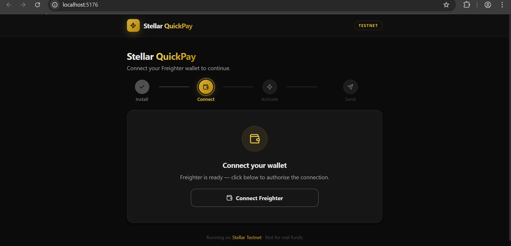
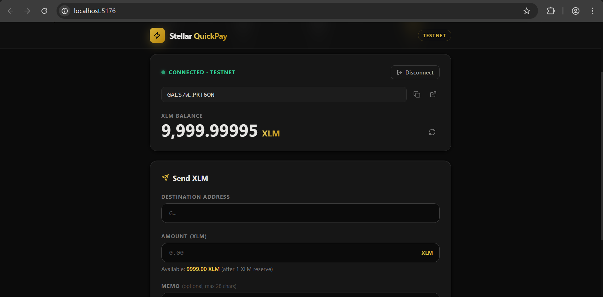
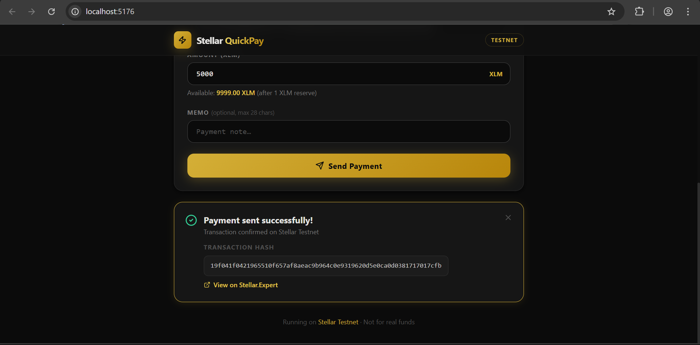

# ⚡ Stellar QuickPay: Obsidian Edition

> A high-performance, premium-tier Stellar payment dashboard. Built with a focus on luxury UI/UX and robust error handling.

---

## 🎯 What's This?
This is a fully functional Stellar dApp built for the **White Belt (Level 1)** Challenge. It abstracts the complexity of the blockchain into a sleek, "FinTech-first" interface, allowing for seamless XLM transfers and real-time account management.

## ✨ Features

### ✅ Core Implementation (Level 1 Requirements)
- **Multi-State Wallet Connection**: Seamless integration with the Freighter wallet.
- **Live Balance Engine**: Real-time XLM balance fetching with auto-refresh logic.
- **Validation-First Payments**: Integrated form validation for recipient addresses and amounts.
- **Transaction Feedback**: Immediate display of transaction hashes with direct links to the **Stellar.Expert** explorer.

### 🎨 Premium "Bonus" Features
- **Obsidian & Gold Palette**: A high-contrast, professional theme designed for high-end DeFi.
- **Auto-Onboarding (Friendbot)**: Detects unactivated Testnet accounts and provides a one-click funding trigger—no need to leave the app!
- **Intelligent Error Parsing**: Maps raw Horizon codes (like `op_underfunded` or `tx_bad_seq`) into human-readable instructions.
- **Network Guard**: Prevents signature failures by detecting if the wallet is set to Mainnet instead of Testnet.

## 📁 Project Structure
```text
stellar-quickpay/
├── src/
│   ├── components/
│   │   ├── WalletCard.tsx      # Connection & Network Status
│   │   ├── BalanceDisplay.tsx  # Obsidian-Gold Balance UI
│   │   ├── PaymentForm.tsx     # Transaction Logic & Inputs
│   │   └── TransactionLogs.tsx # Success/Error Feedback
│   ├── hooks/
│   │   └── useStellar.js       # 🧠 The Brain: Blockchain & SDK logic
│   ├── App.jsx                 # Main Dashboard Layout
│   └── index.css               # Obsidian Theme Variables
└── media/                      # Proof of Work Screenshots

```
## 📸 Proof of Work

### Dashboard


### Onboarding & Funding


### Transaction Success


## 🚀 Installation & Setup
1. **Clone**: `git clone https://github.com/N-thnI/Stellar-QuickPay`
2. **Install**: `npm install`
3. **Run**: `npm run dev`
4. **Note**: Ensure Freighter is set to **Testnet** via Settings > Network.

🆘 Troubleshooting
"Account not found": Your wallet is new. Use the in-app "Fund via Friendbot" button to activate it.

"Signing not possible": Ensure Freighter is switched to Testnet.

"Transaction Failed (400)": Ensure the recipient address is valid and active on the Testnet ledger.
